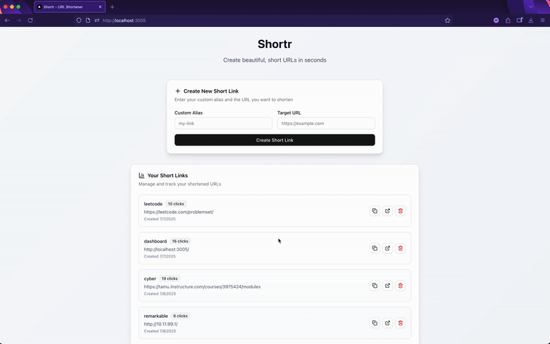

# Shortr - Modern URL Shortener

[](DEMO_SCRIPT.md)
[](#-architecture)
[](#-quick-start)

A **production-ready URL shortener** built with modern full-stack technologies, demonstrating microservices architecture, containerization, and responsive web design.

## 🛠️ **Tech Stack**

**Frontend:**

- ⚛️ **React** with **TypeScript** for type safety
- 🎨 **Next.js 15** for server-side rendering and optimization
- 💅 **Tailwind CSS** for responsive, modern styling
- 🧩 **shadcn/ui** for accessible component library

**Backend:**

- 🟢 **Node.js** with **Express.js** for RESTful API
- 🗄️ **SQLite** with **Prisma ORM** for type-safe database operations
- 🔒 **Input validation** and comprehensive error handling
- 📊 **Click tracking** and analytics

**DevOps & Infrastructure:**

- 🐳 **Docker** containerization for easy deployment
- 🔄 **Docker Compose** for multi-service orchestration
- 🌐 **Nginx** reverse proxy for efficient request routing

## ✨ **Key Features**

🔗 **Custom Short Links** - Create memorable, branded short URLs  
📊 **Analytics Dashboard** - Track click counts and creation dates  
⚡ **Instant Redirects** - Fast, reliable URL redirection  
📱 **Mobile Responsive** - Optimized for all device sizes  
🛡️ **Error Handling** - Comprehensive validation and user feedback  

## 🚀 **Quick Start**

Get the application running in under 30 seconds:

```bash
# Clone the repository
git clone https://github.com/hetk987/Shortr.git
cd Shortr

# Start all services with Docker
./start-shortr.sh
```

**That's it!** The application will build and start automatically.

## 🌐 **Access Points**

| Service         | URL                        | Purpose                       |
| --------------- | -------------------------- | ----------------------------- |
| **Frontend UI** | http://localhost:3005      | Create and manage short links |
| **Short URLs**  | http://localhost/`{alias}` | Redirect endpoint             |
| **API**         | http://localhost:3005/api  | Backend API endpoints         |

## 📸 **Demo**



## 🏗️ **Architecture**

```
                    🌐 Nginx Reverse Proxy
        ┌─────────────────────────────────────────┐
        │         Port 80 │ Port 3005             │
        │      (Redirects) │ (Frontend UI)        │
        └─────────────────────────────────────────┘
                    │              │
            ┌───────▼──────┐  ┌───▼────────────┐
            │   Backend    │  │   Frontend     │
            │  Express.js  │  │    Next.js     │
            │   Port 8080  │  │   Port 3000    │
            └──────────────┘  └────────────────┘
                    │
            ┌───────▼──────┐
            │   Database   │
            │    SQLite    │
            │  + Prisma    │
            └──────────────┘
```

### **Container Architecture**

- 🐳 **3 Docker containers** working in harmony
- 🌐 **Nginx** handles routing and serves as entry point
- ⚡ **Backend** provides REST API with database operations
- 🎨 **Frontend** delivers responsive React application

### **Request Flow**

1. **Short URL** (`/abc123`) → Nginx → Backend → Database → Redirect
2. **Frontend** (`/`) → Nginx → Next.js → API calls → Backend
3. **API calls** (`/api/*`) → Nginx → Backend → Database → Response

## 🛠️ **API Documentation**

| Method   | Endpoint  | Description            | Request Body   |
| -------- | --------- | ---------------------- | -------------- |
| `GET`    | `/`       | List all short links   | -              |
| `POST`   | `/`       | Create new short link  | `{alias, url}` |
| `GET`    | `/:alias` | Redirect to target URL | -              |
| `DELETE` | `/:alias` | Delete short link      | -              |
| `PUT`    | `/`       | Update short link      | `{alias, url}` |

### **Example API Usage**

```bash
# Create a short link
curl -X POST http://localhost:3005/api/ \
  -H "Content-Type: application/json" \
  -d '{"alias": "github", "url": "https://github.com"}'

# Get all links
curl http://localhost:3005/api/

# Test redirect
curl -I http://localhost/github
```

## 📁 **Project Structure**

```
Shortr/
├── 🎨 frontend/             # Next.js React application
│   ├── src/app/            # App router pages
│   ├── src/components/     # Reusable UI components
│   ├── Dockerfile          # Frontend container
│   └── package.json        # Frontend dependencies
├── ⚡ backend/              # Express.js API server
│   ├── src/index.js        # Main server file
│   ├── prisma/            # Database schema & migrations
│   ├── lib/               # Prisma client
│   ├── Dockerfile         # Backend container
│   └── package.json       # Backend dependencies
├── 🐳 docker-compose.yml   # Multi-service orchestration
├── 🌐 nginx.conf          # Reverse proxy configuration
├── 🚀 start-shortr.sh     # One-command startup script
└── 📚 README.md           # Project documentation
```

## 🎯 **Development Highlights**

### **Frontend Excellence**

- ✅ **TypeScript** for compile-time safety
- ✅ **Responsive design** with Tailwind CSS
- ✅ **Component architecture** with shadcn/ui
- ✅ **Real-time updates** and error handling
- ✅ **Accessibility** following WCAG guidelines

### **Backend Robustness**

- ✅ **RESTful API** design
- ✅ **Database migrations** with Prisma
- ✅ **Input validation** and sanitization
- ✅ **Error handling** with proper HTTP codes
- ✅ **Performance optimization** (WAL mode)

### **DevOps Best Practices**

- ✅ **Multi-stage Docker builds** for optimization
- ✅ **Health checks** for service monitoring
- ✅ **Environment configuration** management
- ✅ **Single-command deployment**
- ✅ **Nginx optimization** for production

## 🏆 **Why This Project Stands Out**

🎯 **Production-Ready Code**

- Clean, well-documented, and maintainable
- Follows industry best practices and conventions
- Comprehensive error handling and validation

🚀 **Modern Technology Stack**

- Uses current versions of popular frameworks
- Demonstrates knowledge of containerization
- Shows understanding of microservices architecture

🛠️ **Technical Problem Solving**

- Efficient database design with click tracking
- Smart URL validation with protocol handling
- Optimized reverse proxy configuration

📱 **User Experience Focus**

- Responsive design works on all devices
- Intuitive interface with real-time feedback
- Accessibility considerations built-in

## 🚀 **Deployment Options**

### **Local Development**

```bash
./start-shortr.sh
```

### **Production Deployment**

- **Railway**: `railway up` (configure environment variables)
- **DigitalOcean**: Use App Platform with Docker Compose
- **AWS/GCP**: Deploy containers to ECS/Cloud Run
- **Self-hosted**: Use any Docker-capable server

## 🔧 **Configuration**

### **Environment Variables**

```bash
# Backend
NODE_ENV=production
DATABASE_URL=file:/app/prisma/dev.db
PORT=8080

# Frontend
NEXT_PUBLIC_API_URL=http://backend:8080
```

## 📞 **Contact & Questions**

Built with ❤️ by Het Koradia

- 📧 **Email**: het.koradia.1@gmail.com
- 💼 **LinkedIn**: linkedin.com/in/het-koradia
- 🐙 **GitHub**: github.com/hetk987
